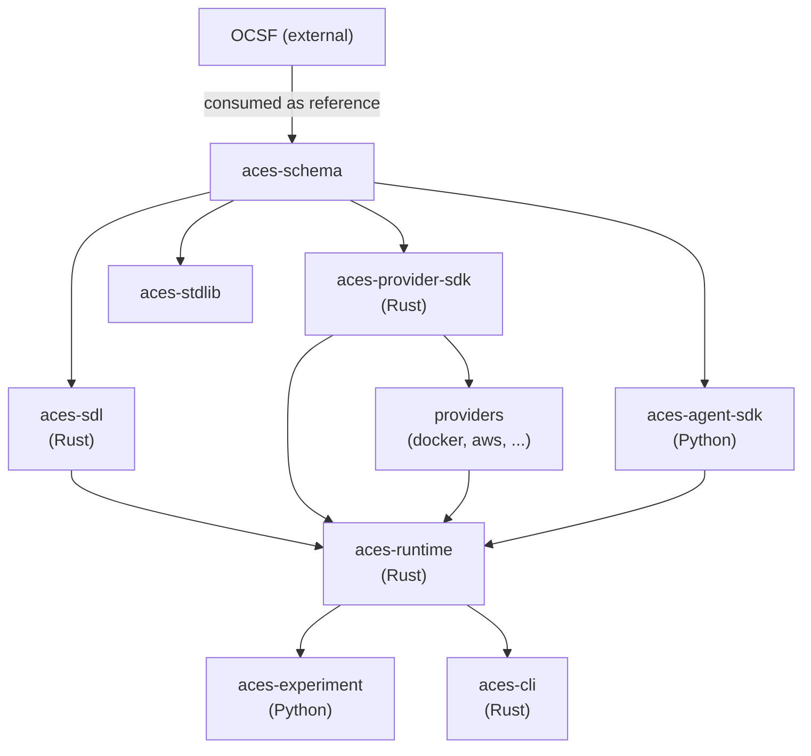

# ACES Architecture

This is the canonical architecture reference for the ACES project. All
architectural principles, repository structure, interface boundaries,
and build coordination are defined here.

For architectural decisions, see [`adrs/`](adrs/).
For engineering standards, see [`STANDARDS.md`](STANDARDS.md).

## Architecture Principles

These principles are derived from the ACES paper and inform every
repository boundary decision.

1. **Parnas decomposition** — Repos encapsulate design decisions that
   change independently, are owned by different communities, and compose
   through well-defined interfaces. (Paper Section 1)

2. **Semantic model independence** — The core type system (aces-schema)
   is defined independently of any concrete syntax, runtime
   implementation, or backend. Everything builds on it; nothing modifies
   it without RFC. (Paper Section 8, citing Fowler)

3. **Specification as sole researcher interface** — A researcher
   interacts only with the specification file. The runtime, providers,
   and infrastructure are invisible. (Paper Section 7)

4. **Specification as auditable artifact** — Every exercise is defined
   by an inspectable, machine-readable specification. No exercise runs
   without one. This serves both reproducibility and governance. (Paper
   Section 8.2)

5. **Backend and participant agnosticism** — The same specification can
   be instantiated on VMs, containers, or pure simulation; by humans,
   AI agents, or scripted playbooks. No participant or backend type is
   privileged over another. (Paper Sections 5.1, 5.2)

6. **OCSF as the event lingua franca** — All exercise observation,
   scoring, and assessment operates on OCSF-formatted events. This makes
   scoring backend-independent and datasets structurally comparable.
   (Paper Section 3.2)

7. **Extension without modification** — New domain types (OT/ICS,
   wireless, etc.), new backends, and new scoring modes are added via
   the extension mechanism, not by modifying core schema. OT/ICS is the
   litmus test. (Paper Section 9)

8. **Design for extraction** — Internal modules within a repo are
   designed as if they were separate repos (clean interfaces, no shared
   mutable state). This makes future splitting non-disruptive.

## Repository Architecture

**Strategy**: Multi-repo (polyrepo) with a shared governance hub
(ADR-0005).

Different layers attract different communities (DSL designers vs. infra
engineers vs. ML researchers vs. security practitioners). Backend
providers must be independent. Content packages are naturally
independent. Access control requirements differ per repo.

Coordination mechanisms: SemVer versioning (ADR-0016), RFC process for
cross-cutting changes, compatibility matrix, cross-repo integration
tests.

### Language Decision (ADR-0001)

Rust core + Python periphery. Two languages.

| Component | Language | Rationale |
|-----------|----------|-----------|
| aces-schema | Language-agnostic (protobuf or JSON Schema) | Consumable by both Rust and Python. Protobuf gives typed stubs and gRPC wire protocol. |
| aces-sdl | Rust | Parser + validator + formal verification (tiers 1-2). Excellent parser generators (pest, lalrpop, nom). Tier 2 semantic verification uses an external automata theory crate (ADR-0004). |
| aces-runtime | Rust | Long-running, high-concurrency infrastructure service. Memory safety, no GC pauses, excellent async (tokio), first-class gRPC (tonic). Single binary. |
| aces-cli | Rust | Same language as runtime + sdl. Shares domain types in-process. Single binary, fast startup, cross-compilation. |
| aces-provider-sdk | Rust | Matches runtime language. Providers themselves can be any language — the SDK defines a gRPC contract. |
| aces-agent-sdk | Python | Non-negotiable. Gymnasium, PettingZoo, PyTorch, stable-baselines3, LangChain — the entire ML/AI agent ecosystem is Python. |
| aces-experiment | Python | Integrates with MLflow, W&B, scipy/numpy. Primary users are researchers working in Python. Talks to runtime over gRPC. |
| aces-provider-docker | Rust | First provider. Rust has good Docker API libraries (bollard). Matches provider-sdk language. |

### Tiered Repository Map

#### Tier 0: Governance

| Repo | Purpose |
|------|---------|
| **aces** | Project governance, RFCs/ADRs, community docs, cross-repo CI templates, compatibility matrix. The front door. No application code. |

#### Tier 1: Specification Foundation

| Repo | Layer | Purpose | Depends On |
|------|-------|---------|------------|
| **aces-schema** | Specification | **The foundational repo.** Machine-readable semantic model (all domain types, relationships, constraints). Language-agnostic (protobuf or JSON Schema). Formal prose specification. OCSF vocabulary mappings (built-in, not optional). Extension/profile mechanism. Schema versioning with SemVer and breaking-change rules (ADR-0016). | OCSF (external reference) |
| **aces-sdl** | Specification | Rust parser. Validates against schema constraints. Static verification (tier 1) and semantic verification (tier 2). | aces-schema, automata crate (external) |

#### Tier 2: Interface SDKs

| Repo | Layer | Purpose | Depends On |
|------|-------|---------|------------|
| **aces-provider-sdk** | Instantiation | Provider contract definition + helpers + conformance test harness. Defines what a backend must implement: provision, status, checkpoint, restore, destroy, capability declaration, DryRun/Plan (ADR-0012). Wire protocol definitions (gRPC). Providers themselves can be any language — the SDK defines the gRPC contract. | aces-schema |
| **aces-agent-sdk** | Instantiation | Thin `gymnasium.Env` / PettingZoo client wrapping gRPC calls. Multi-agent support. Must be lightweight and pip-installable — no parser or semantic model dependency. | aces-schema |

#### Tier 3: Core Framework

| Repo | Layer | Purpose | Depends On |
|------|-------|---------|------------|
| **aces-runtime** | Runtime | Core engine (tokio, tonic gRPC). Loads specifications, orchestrates execution, manages state, coordinates participants, distributes events, scores exercises. Participant coordinator owns interface generation: derives observation/action/reward interfaces from scenario spec + role assignment and serves them to agents (ADR-0003). Monolith with modular internals (ADR-0017). | aces-schema, aces-sdl, aces-provider-sdk, aces-agent-sdk |
| **aces-experiment** | Experimentation | Experiment harness. Trial management, instantiation constraint enforcement, data collection, artifact packaging, reproducibility controls. | aces-schema, aces-sdl, aces-runtime |

#### Tier 4: Backend Providers (created on demand)

| Repo | Layer | Purpose | Depends On |
|------|-------|---------|------------|
| **aces-provider-docker** | Instantiation | Docker container-based infrastructure (bollard crate). | aces-provider-sdk |
| **aces-provider-openstack** | Instantiation | OpenStack backend. | aces-provider-sdk |
| **aces-provider-vsphere** | Instantiation | VMware vSphere backend. | aces-provider-sdk |
| **aces-provider-aws** | Instantiation | AWS EC2/VPC backend. | aces-provider-sdk |
| **aces-provider-simulation** | Instantiation | Pure simulation backend. Fidelity equivalence litmus test. | aces-provider-sdk |

#### Tier 5: Content and Tooling

| Repo | Layer | Purpose | Depends On |
|------|-------|---------|------------|
| **aces-stdlib** | Content | Reusable scenario components, behavioral templates, scoring templates, reference scenarios. | aces-schema (written in SDL syntax) |
| **aces-cli** | Tooling | Rust CLI (clap). validate, run, experiment, package, provider management, inspect. Single binary. | aces-schema, aces-sdl, aces-runtime, aces-experiment |
| **aces-docs** | Tooling | Documentation website. | None (consumes others as input) |

## Dependency Graph

**Key property**: aces-schema has zero upstream dependencies. No circular
dependencies exist. The graph is a clean DAG.

## Interface Boundaries

Each boundary is a contract between repos. These define where teams
coordinate — getting them right is the difference between parallel
development and blocking dependencies.

### Boundary 1: aces-schema to everything

**What crosses**: Type definitions. Every repo that processes ACES
artifacts imports types from aces-schema.

**Contract**: The schema publishes versioned type definitions (SemVer,
ADR-0016). Consumers pin to a schema version. Breaking changes follow
formal rules (new required fields = major version bump). The extension
mechanism allows adding types without breaking existing consumers.

**Coordination**: Schema changes affecting types used by multiple
consumers require an RFC before merging. Non-breaking extensions can be
merged with normal review.

### Boundary 2: aces-schema to aces-sdl

**What crosses**: aces-sdl imports the semantic model types and produces
instances of them from parsed files.

**Contract**: aces-sdl MUST produce valid aces-schema instances. aces-sdl
MUST validate all schema constraints. aces-sdl MAY add syntax sugar
that maps to schema types. aces-sdl MUST NOT invent types that do not
exist in aces-schema.

**Coordination**: When aces-schema adds a new type, aces-sdl needs a
corresponding syntax addition. This can lag.

### Boundary 3: aces-schema to aces-provider-sdk

**What crosses**: Infrastructure types (nodes, networks, features,
fidelity metadata, lifecycle operations).

**Contract — the Provider Interface**:

- `Provision(spec) -> status` — create infrastructure from specification
- `Status() -> state` — report current state
- `Checkpoint(id) -> snapshot` — snapshot current state
- `Restore(snapshot) -> status` — restore from snapshot
- `Destroy() -> status` — tear down infrastructure
- `Capabilities() -> declaration` — declare what this provider can do
- `DryRun(spec) -> plan` — capability verification (ADR-0012)

Providers emit OCSF-formatted status events.

**Coordination**: The provider interface is the most critical API to get
right early. If it changes, all providers must update. Capability
declarations allow providers to support new features without interface
changes.

### Boundary 4: aces-schema to aces-agent-sdk

**What crosses**: Entity types (roles, capabilities, permissions), agent
interface types (observation/action/reward space definitions).

**Contract — the Agent Interface**:

- **Observation space**: Defined per role in the scenario specification.
  Telemetry feeds (OCSF events), accessible network segments, visible
  process/service states, exercise timeline position, scoring state.
- **Action space**: Defined per role. Available tools per role
  permission, allowed commands, rate limits.
- **Reward signals**: Dense (per-event) or sparse (end-of-episode),
  configurable via specification.
- **Step function**: `step(action) -> (observation, reward, done,
  truncated, info)` following Gymnasium convention.
- **Multi-agent**: PettingZoo-style parallel environment interface.

**Coordination**: This interface determines whether the ML/AI research
community can actually use ACES. Must be reviewed by agent researchers.

### Boundary 5: aces-provider-sdk to aces-runtime

**What crosses**: The runtime calls providers to provision
infrastructure. Providers report status back.

**Contract**: Runtime is CLIENT. Provider implementations are SERVERS.
Runtime discovers available providers and their capabilities, selects
providers based on scenario requirements, manages provider lifecycle.
Communication over gRPC (ADR-0015), protocol defined in
aces-provider-sdk (ADR-0007).

### Boundary 6: aces-agent-sdk to aces-runtime

**What crosses**: The runtime serves agent connections. Agents connect,
receive observations, submit actions.

**Contract**: Runtime is SERVER. Agent implementations are CLIENTS.
Runtime generates observation/action/reward interfaces from the scenario
specification and role assignment (ADR-0003). The agent SDK is a thin
client wrapping the served interface into idiomatic `gymnasium.Env`
classes.

### Boundary 7: aces-sdl to aces-runtime

**What crosses**: Parsed scenario specifications (as aces-schema
instances).

**Contract**: Runtime receives a validated aces-schema instance. Runtime
does not parse files directly — it receives pre-parsed, pre-validated
data from aces-sdl.

### Boundary 8: aces-runtime to aces-experiment

**What crosses**: The experiment harness wraps the runtime to execute
exercises under experimental controls.

**Contract**: Experiment harness calls runtime APIs to create exercises,
configure constraints, start/stop/checkpoint, collect telemetry. Runtime
supports deterministic seeding, trial isolation, checkpoint/restore,
telemetry export.

**Coordination**: The experiment layer's requirements must be baked into
the runtime API from the start.

### Boundary 9: aces-runtime to aces-cli

**What crosses**: CLI sends commands to the runtime and receives
status/results.

**Contract**: CLI is a thin client over the runtime API. Runtime exposes
a management API (create/list/start/stop/inspect exercises). CLI also
calls aces-sdl directly for validation (no runtime needed).

## Critical Path and Build Order

```mermaid
gantt
    title ACES Build Order
    dateFormat X
    axisFormat Phase %s

    section Phase 1 — Foundation
    aces (governance)              :p1a, 1, 4
    aces-schema (CRITICAL PATH)    :crit, p1b, 1, 4

    section Phase 2 — Spec + Interfaces
    aces-sdl (Rust, parser)        :p2a, after p1b, 6
    aces-provider-sdk (Rust)       :p2b, after p1b, 6
    aces-agent-sdk (Python)        :p2c, after p1b, 6

    section Phase 3 — Execution
    aces-runtime (Rust)            :p3a, after p2a p2b p2c, 10
    aces-provider-docker (Rust)    :p3b, after p2b, 8
    aces-stdlib (content)          :p3c, after p2a, 8

    section Phase 4 — Integration
    aces-cli (Rust)                :p4a, after p2a p3a, 6
    aces-experiment (Python)       :p4b, after p3a, 6
    aces-docs                      :p4c, after p3a, 6

    section Phase 5+ — Ecosystem
    aces-provider-* (on demand)    :p5a, after p2b, 12
    Community content              :p5b, after p3c, 12
```

### Parallelization

| Work | Can run in parallel with | Coordination point |
|------|--------------------------|-------------------|
| Schema design | Governance setup | None |
| SDL syntax design | Provider SDK design | Both need schema but different types |
| Agent SDK design | Provider SDK design | Both need schema but different types |
| Docker provider impl | Runtime design | Provider implements SDK; runtime calls SDK |
| Content authoring | Runtime development | Content validates via SDL, not runtime |

### The Schema Bottleneck

aces-schema is the single bottleneck. Mitigations:

1. Staff it first and well.
2. Ship initial types quickly (even if incomplete).
3. Extension mechanism works from day one.
4. Fast review process for schema PRs.

## HLA Runtime Service Coverage

The paper maps HLA's six service categories to ACES runtime modules:

| HLA Service | ACES Module | Repo | Notes |
|-------------|-------------|------|-------|
| Federation management | Federation module | aces-runtime (internal, future extraction candidate) | Multi-site exercise coordination |
| Declaration management | Event bus (pub/sub declarations) | aces-runtime (internal) | Components declare what they produce/consume |
| Object management | State manager | aces-runtime (internal) | Shared exercise state |
| Ownership management | Ownership module | aces-runtime (internal) | Transfer control of objects between participants |
| Time management | Time services | aces-runtime (internal) | Hardest problem. Hybrid real/simulated time coordination. |
| Data distribution management | Event bus (relevance routing) | aces-runtime (internal) | Relevance-based filtering per participant role and exercise position. Prevents overload in large exercises. |

## Scoring Flexibility Requirement

The scoring engine (aces-runtime internal) and scoring types
(aces-schema) must support three fundamentally different evaluation
semantics:

1. **Binary flag capture** — Jeopardy CTF. Discrete flags, binary
   pass/fail.
2. **Continuous time-pressured A&D** — Attack & Defense CTF.
   Simultaneous offense and defense, continuous scoring over time.
3. **Multi-objective incident response** — IR exercises. Multiple
   objectives with different weights, partial credit,
   time-to-detect/respond metrics.

The schema's assessment types must express scoring MODE and temporal
STRUCTURE, not just conditions and thresholds.

## Verification Model (ADR-0002)

Four-tier verification, each owned by a different component:

| Tier | Domain | Question | When | Where |
|------|--------|----------|------|-------|
| 1. Static | Syntactic + structural | Is this spec well-formed? Missing refs? Type errors? | Instant, offline | aces-sdl |
| 2. Semantic | Formal/logical | Do detection rules cover the attack paths? Is the scenario logically coherent? | Offline, reasoning over scenario graph | aces-sdl |
| 3. Capability | Infrastructure | Can the connected backends actually provision this? | Requires backend connection | Provider SDK (DryRun/Plan, ADR-0012) + Runtime |
| 4. Constraint | Experimental | Does the running environment meet research constraints (determinism, fidelity, scale)? | Post-provisioning | aces-experiment |

## Adjacent Systems

These are not ACES repos but are consumers of ACES interfaces. The
schema and package format must accommodate them.

| Adjacent System | Consumes (from ACES) | Produces (for ACES) |
|-----------------|---------------------|---------------------|
| CTI pipelines (threat intel to scenarios) | Schema spec format | Scenario fragments |
| LLM authoring tools (e.g., ARCeR) | Schema types | Generated scenario configs |
| Content management systems | Package manifest + metadata | Curated scenarios |
| Synthetic content generators | Content slot declarations in specs | Filled content data (users, emails, traffic) |

## Existing Code Disposition

**Principle: Extract design decisions, not code** (ADR-0010).

| Existing Project | Disposition | What We Take |
|-----------------|-------------|-------------|
| OCR SDL semantic model | Learn from, redesign | Domain concepts (nodes, features, entities, roles, scoring pipeline). Not the YAML format or type definitions. |
| OCR SDL-parser | Do not use | Nothing. New schema needs new parser. |
| OCR Ranger | Study architecture | Internal module boundaries, orchestration patterns. |
| OCR Deputy | Study concept | Content library concept, packaging approach. |
| OCR Openstack-Handler | Future reference | OpenStack API integration patterns (when building aces-provider-openstack). |
| OCR VMWare-Handler | Future reference | vSphere API integration patterns (when building aces-provider-vsphere). |
| OCSF | Consume as external dependency | Schema definitions, extension patterns, versioning model. |
| SISO Cyber DEM/FOM | Consume as external standard | Federation data model (when building federation support). |
| CybORG | Learn interface pattern | Gymnasium-compatible agent interface design. |
| HLA/TENA | Conceptual blueprint | Six runtime service categories, time management model. |

## Open Architectural Questions

Resolved questions are noted. Remaining open items require ADRs before
creating the repos they affect.

| # | Question | Affects | Status |
|---|----------|---------|--------|
| 1 | GitHub org name | All repos | **Resolved**: `aces-framework` |
| 2 | Schema definition format | aces-schema | Open. Options: JSON Schema, CUE, KCL, Pkl, custom. CUE is pre-1.0 with thin adoption. KCL is CNCF Sandbox with Rust impl. Pkl has JVM dependency. JSON Schema is the safest baseline. |
| 3 | Primary runtime language | aces-runtime, aces-cli | **Resolved**: Rust (ADR-0001) |
| 4 | Mono-language vs poly-language | All framework repos | **Resolved**: Two languages — Rust core + Python periphery (ADR-0001) |
| 5 | Wire protocol | SDKs, runtime | **Mostly resolved**: gRPC (ADR-0015). REST gateway deferred. |
| 6 | SDL concrete syntax | aces-sdl | Open. Options: YAML-first, CUE-first, KCL-first. CUE upgrade path is risky (pre-v1.0). Safest path: YAML validated against schema types, with composition tooling evaluated separately. |
| 7 | Verification model | sdl, provider-sdk, runtime, experiment | **Resolved**: Four-tier model (ADR-0002). Implementation details per tier remain open. |
| 8 | Content differential updates | aces-schema, aces-stdlib | Open. Scenarios evolve with threats; format must support incremental updates. |
| 9 | SISO standards access | aces-runtime (federation) | Open. Standards are not freely available. Affects federation implementation approach. |
